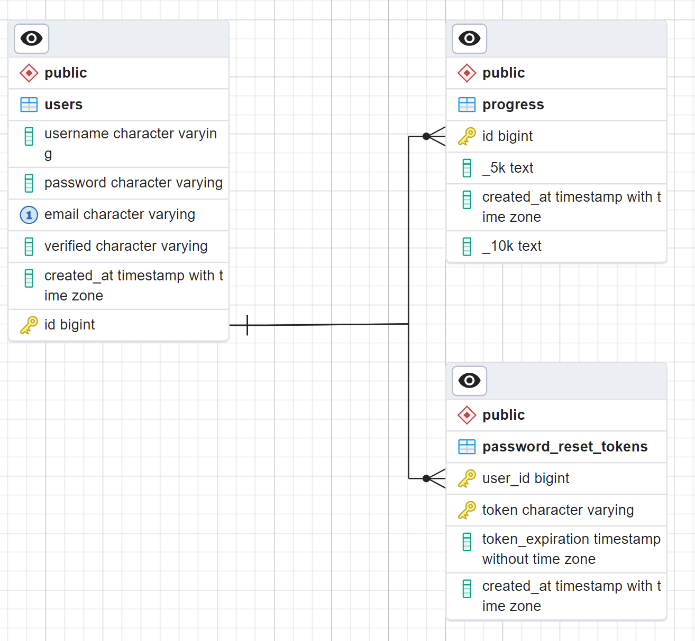

# Project Summary
The purpose of this document is to detail the technology, tools, languages, frameworks, concepts, skills, and any other ideas that I encountered while building this project. This document was created mostly for my sake, in order to remember, reference, and solidify all of the many things I learned throughout this process, but will also serve to highlight all the technological facets that this project touches upon.

# JavaScript
When I started this project, I made some simple JavaScript games in the past, but this introduced me to more intermediate concepts for the first time.

## Promises and Async/Await

I don't think it is an exageration to say that promises and async/await calls, along with callbacks, were some of the most challenging programming concepts I ever had to wrap my head around. I knew I had to make an effort to fully understand these, as they are central to the language, but I will admit that they broke my brain many times in the process. There is nothing even really that complex about them, but this asynchrnonous paradigm is just so unlike what I have worked with before, that it took me many tries before using them clicked for me.

Inside the folder `learning_examples` are some files that explore what Promises are, how the resolve / reject functionality works, and promises differ from async/await. I needed to create these examples to really understand for myself how these concepts work and clear up some misconceptions I had. Hoepfully these can help you too, if you are also confused like I was!

Additionally, taking methods that I wrote promises, and rewriting them using the async/await really helped with understanding the differences. By doing this, I finally understood the true power and usefulness of async/await.

# Node + Express
Express makes it very easy to setup the various routes needed for the node server. The biggest initial challenges working with node and express were understanding what data is actually being sent in the request and response variables, why this is a callback, and middleware.  

## EJS (Embedded JavaScript)
There were many times where I would want to render a page, but make some slight changes based on information in the server response. For example, I wanted to display the user's username on the main page, or display the appropriate error message to the user depending on what went wrong. To do this, I decided to use the templating language EJS. This also allowed me to adhere to DRY, as I could use EJS to include a header and footer on every page, and I would only need to update the respective header and footer files if I wanted to make any changes, instead of needing to update every file that used them. Working with this reminds me very much of PHP, as you can inject backend logic straight into an otherwise purely html page.

# AWS

## EC2

### Shell

### systemd

## Code Deploy

### `appspec.yml`

## Code Pipeline

## Parameter Store

## Security (?)

# Database

## Deciding on Postgres and supabase
I decided to use a relational database, because I don't have much experience with NoSQL databases, and I didn't anticipate anything that a NoSQL database would lend itself better to handling than a regular SQL database would. I also knew I would least need relations between users and their progress, so a SQL database made the most sense. I went with Postgres, because again this is what is the RDBMS that I was most familiar with, and I saw that it had good support with NodeJS via the `pg` library.

When first developing this application, I just set up a local Postgres database, and wrote queries / constructed tables using pgAdmin. When I decided that I wanted to host this application, I considered a few options. I already decided on using an AWS EC2 instance to host the node application, so I first explored other AWS services for hosting. AWS RDS has a Postgres option, but this costs money. It is cheap, but I wanted an option that would be entirely free so I didn't have to worry about a big bill if there was some oversight on my end. This is also the reason why I also decided against AWS Aurora, which also has a Postgres option. Another AWS option was hosting my own Postgres server on a separate EC2 instance, but again this isn't totally free, and I wanted a quicker option that I didn't need to configure and could just get up and running. 

So after some research, I decided to use Supabase, which is a free, open-source, cloud Postgres database option (backed by AWS). I am glad I chose this option, because it is very user-friendly and convenient.

## Database Structure
Below is the ERD for this application's database. It is very simple, but even this required significant thought and planning.

## users

## progress

## password_reset_tokens

# User management

## Session management

## Signup

## Login

## Forgot Password

### bcrypt
This lets us hash passwords, by specifying a number of "salt" rounds we want to apply. I need to do more research about how hasing methods, and how this works under the hood.

# General Concepts

## Error Handling

## Ajax
This was actually my first time using and learning about ajax. In this project, an ajax call allowed me to update the progress table dynamically, without the need to refresh the page or send back an entirely new page upon recieving a response from the server. I was going to just use the 204 response code (no content) which would have served the same purpose, but the 'Completed' checkbox did not have a submit button on its form, so I couldn't trigger a post route.

## Pessimistic Updating
One issue that I ran into was the following: The user would check the 'Completed' box, and the UI would update immediately (i.e., the box becomes checked and the table cell would become grayed out). Although this happens almost instantly when this ajax request is succesful, if there was an error updating the database, the user would still see that the box become grayed out. That is, they would see a signal that their action was successful, without any indication that their action failed. If they were to refresh the page or log back in at a later time, they would see that their progress was not actually saved when they thought it was, which is a bad user experience. To solve this, I actually disable all further interactive user actions, and change the cursor to a loading icon until the ajax response reports back that the update has been completed successfully. It is a change that is barely noticeable when things are working as expected, but becomes very important if unexpected issues were to arise.

## Separation of Server vs Client
I already knew the separation of concerns between the sever and client, and which should do what, but it was still tricky at times to makes sure each has only the necessary and sufficient information to do its job properly. For example, after deciding to use session ids to keep track of logged in users, I had to think about what was necessary to pass between requests, and what I could leave out but retrieve when necessary, to ensure there was no security concern. To do this, I just passed around the user's arbitrary user id. Another salient moment was when I realized that I should actually have the code to generate the main workout progress tables located server-side, instead of as a client-side script like I had when this project was still just a static application.

# Acknowledgements
I used countless resources during the making of this project, but I will highlight some of the best and most important ones below:

* [Angela Yu's Web Development Udemy Course](#https://www.udemy.com/course/the-complete-web-development-bootcamp/?utm_source=adwords&utm_medium=udemyads&utm_campaign=LongTail_la.EN_cc.US&utm_content=deal4584&utm_term=_._ag_81829991707_._ad_532193842022_._kw__._de_c_._dm__._pl__._ti_dsa-1007766171312_._li_9006788_._pd__._&matchtype=&gad_source=1&gclid=Cj0KCQjw-r-vBhC-ARIsAGgUO2AtKNpkbEsFWsSRePRq3KJYs3dDAQbd4d2M2Pmxzne2nr-rdBU4s0oaArdcEALw_wcB&couponCode=2021PM20)
* Understanding the order of execution between synchronous, asynchronous, and promises: This [post](#https://stackoverflow.com/questions/63257952/understanding-async-js-with-promises-task-and-job-queue) and [video](#https://www.youtube.com/watch?v=28AXSTCpsyU)
* [Deploying a node application to EC2](#https://www.youtube.com/watch?v=oHAQ3TzUTro)
* [Implementing a 'Forgot Password' workflow](#https://supertokens.com/blog/implementing-a-forgot-password-flow#)

For a full list of all resources and notes, see `daily_log.txt`.